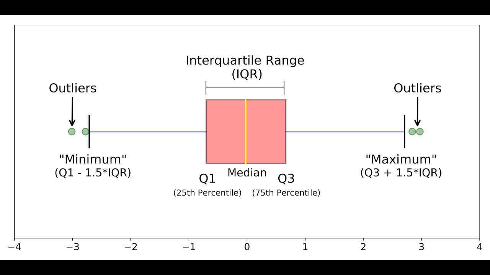

# ggplot2

```{r global_options, include=FALSE}
knitr::opts_chunk$set(fig.width=5, fig.height=4,
                      echo=TRUE, warning=FALSE, message=FALSE)
```

* Graphing package inspired by the **G**rammar of **G**raphics work of Leland Wilkinson:
  
* *The Grammar of Graphics is based on the idea that every graphic can be broken down into a series of components or layers. These components include the data, the aesthetic mapping, the geometric shapes, the statistical transformation, and the scales.* [source](https://medium.com/aiskunks/data-visualization-grammar-of-graphics-fccf78379b52)

* Flexible, versatile, customizable.

* Well documented.


*image from https://www.cedricscherer.com/img/ggplot-tutorial/overview.png*


## Getting started

A ggplot graph needs at least 3 components:

* **Data**: that is the source data that we want to represent.
* **Aesthetics** mappings: they describe what will be visualized from **data**. What are you trying to show?
* **Geometrics**: functions that represent what we see in the graph: lines, points, boxes etc. for example:
  * geom_point()
  * geom_lines()
  * geom_histogram()
  * geom_boxplot()
  * geom_bar()
  * geom_smooth()
  * geom_tiles()

The base structure is the following:

**ggplot(\<DATA\>, \<AESTHETICS\>) + \<GEOMETRICS\>**


For example if we want to represent **column1** (on the x axis) and **column2** (on the y axis) of **data** as **points**, we can use the following structure:

```{r, eval=F, echo=TRUE}
ggplot(data=dataframe, mapping=aes(x=column1, y=column2)) + geom_point()
```

This will be our template as we explore different types of graphs.

We can add **more layers and components** to this base structure to customize the plot, as we will see in the next examples.

## Scatter plot

### Base plot

We can start from the **geneexp** object, that holds the content of file *expression_20genes.csv*: we want to plot **sample1** on the x axis and **sample2** on the y axis.

The base layer will be the following:

```{r, eval=T}
ggplot(data=geneexp, mapping=aes(x=sample1, y=sample2))
```

Copy-paste this in the console, and hit Enter. 

As you can see, nothing is plotted yet: the base is set.

Adding to the base layer the geometrics called **geom_point()**, we **tell ggplot to produce a scatter/point plot**:

```{r, eval=T}
# This line is a comment: a comment is not interpreted by R.
# Example of a scatter plot: add the geom_point() layer
ggplot(data=geneexp, mapping=aes(x=sample1, y=sample2)) + 
  geom_point()

# Note that the new line is NOT necessary after the "+": it is done for clarity / readability.
```

Please, copy the code above in your script, and hit Enter!

Your plot should appear in the "Plots" tab in the bottom-right panel.

### Customize the points

**geom_point()** can take parameters, including the point color and size:

Color all points in red:

```{r}
ggplot(data=geneexp, mapping=aes(x=sample1, y=sample2)) + 
  geom_point(color="red")
```

Increase point size (default size is 1.5):

```{r}
ggplot(data=geneexp, mapping=aes(x=sample1, y=sample2)) + 
  geom_point(color="red", size=2.5)
```

This is a good place to introduce the **help pages** of functions.

Functions in **ggplot2** (and **tidyverse** in general) are richly documented.

While documentation can be quite technical it is always good practice to take a look at it.

You can access the help page of a function in the **Help** tab in the bottom-right panel. Give it a try with "geom_point":


Back to our customization: let's set different shapes for the points!

This is done by setting the **shape** parameter in **geom_point()**.

Points can become, for example, triangles:

```{r}
ggplot(data=geneexp, mapping=aes(x=sample1, y=sample2)) + 
  geom_point(color="red", size=2.5, shape="triangle")
```

See more options in the following image:


*Image from ggplot2 documentation*

Note that you can also replace the points by any character, the following way:

```{r}
ggplot(data=geneexp, mapping=aes(x=sample1, y=sample2)) + 
  geom_point(color="red", size=2.5, shape="$")
```

### Add more layers

We can add more layers to the plot, using the same structure (**+ layer_name()**)

#### ggtitle()

Add a title using the **ggtitle()** layer:

```{r}
ggplot(data=geneexp, mapping=aes(x=sample1, y=sample2)) + 
  geom_point(color="red", size=2.5, shape="diamond") +
  ggtitle(label="my first ggplot")
```

**label** is a parameter of **ggtitle()** function.

#### Background

Not a big fan of the grey background?


This is the default "theme", but there are [more options](https://ggplot2.tidyverse.org/reference/ggtheme.html).

For example:

```{r}
ggplot(data=geneexp, mapping=aes(x=sample1, y=sample2)) + 
  geom_point(color="red", size=2.5, shape="diamond") +
  ggtitle(label="theme grey (the default theme)") +
  theme_grey()
```

```{r}
ggplot(data=geneexp, mapping=aes(x=sample1, y=sample2)) + 
  geom_point(color="red", size=2.5, shape="diamond") +
  ggtitle(label="theme linedraw") +
  theme_linedraw()
```

```{r}
ggplot(data=geneexp, mapping=aes(x=sample1, y=sample2)) + 
  geom_point(color="red", size=2.5, shape="diamond") +
  ggtitle(label="theme bw = black and white") +
  theme_bw()
```

```{r}
ggplot(data=geneexp, mapping=aes(x=sample1, y=sample2)) + 
  geom_point(color="red", size=2.5, shape="diamond") +
  ggtitle(label="theme void") +
  theme_void()
```

Here is a good page to check the different backgrounds:
https://ggplot2-book.org/themes#sec-theme

Note that you can also change some settings globally as you use a new theme, e.g. 

* *base_size*: by default, 11.
* *base_family*: the font (uses by default arial or sans). To check the fonts that are available, type *systemfonts::system_fonts()$family*
* *base_line_size*: by default, base_size/22.
* *base_rect_size*: by default, base_size/22


```{r}
# get full list of available fonts in your system with: 
ggplot(data=geneexp, mapping=aes(x=sample1, y=sample2)) + 
  geom_point(color="red", size=2.5, shape="diamond") +
  ggtitle(label="my first ggplot") +
  theme_bw(base_size=18, base_family = "Laksaman", base_line_size = 2, base_rect_size = 4)
```

#### Regression line

Add a regression line with **geom_smooth()**. A smoothed line can help highlight the dominant pattern/trend.

```{r}
ggplot(data=geneexp, mapping=aes(x=sample1, y=sample2)) + 
  geom_point(color="red", size=2.5, shape="diamond") +
  ggtitle(label="my first ggplot") +
  theme_linedraw() +
  geom_smooth()
```

Remove the confidence interval:

```{r}
ggplot(data=geneexp, mapping=aes(x=sample1, y=sample2)) + 
  geom_point(color="red", size=2.5, shape="diamond") +
  ggtitle(label="my first ggplot") +
  theme_linedraw() +
  geom_smooth(se=FALSE)
```

Different methods can be used to fit the smoothing line:

* "lm": linear model.
* "glm": generalized linear model.
* "gam": generalized additive model.
* "loess": local polynomial regression.
* A function (more advanced)

By default, the smoothing method is picked based on the size of the largest group across all panels.

```{r}
ggplot(data=geneexp, mapping=aes(x=sample1, y=sample2)) + 
  geom_point(color="red", size=2.5, shape="diamond") +
  ggtitle(label="my first ggplot") +
  theme_linedraw() +
  geom_smooth(se=FALSE, method="lm")
```

<details>
<summary>
*More advanced (as reference, or if someone asks): add correlation coefficient:*
</summary>

You can add the correlation coefficient between the 2 variables, using another function from the {ggpubr} package:

```{r}
ggplot(data=geneexp, mapping=aes(x=sample1, y=sample2)) + 
  geom_point(color="red", size=2.5, shape="diamond") +
  ggtitle(label="my first ggplot") +
  theme_linedraw() +
  geom_smooth() +
  ggpubr::stat_cor(method = "pearson", label.x = 3, label.y = 30)
```

</details>


## Save your plot

### From the RStudio interface

Before we dive into more graph types, let's pause and learn how to easily save the current plot.

In the "Plots" tab, click on "Export" and "Save as image":


From that windows, you can:

* Pick an image format between: PNG, JPEG, TIFF, BMP, SVG, EPS.
* Choose where you want to **save the output file** (by default, R will propose the current working directory).
* Choose the **file name**.
* Set the dimensions, by either:
  * Setting the Width and Height of the figure (in pixels)
  * Moving the graph manually (bottom-right corner of the plot) until you obtain the size and proportions that you want.


### From the console

The best way to save a plot to a few from the console, is using the ggsave function.

First, you need to save the plot to an object (if you don't, ggplot will create a file from the latest plot, which is fine too!).

```{r}
myplot <- ggplot(data=geneexp, mapping=aes(x=sample1, y=sample2)) + 
  geom_point(color="red", size=2.5, shape="diamond") +
  ggtitle(label="my first ggplot")
```

Many different formats are available:

* eps
* ps
* tex
* pdf
* jpeg
* tiff
* png
* bmp
* svg
* wmf

```{r}
ggsave(filename="myplot.png", plot=myplot, device="png")
```

You can specify the plot size units between inches "in", centimeters "cm", milimeters "mm" or pixels "px".

You can also specify the **dpi**, i.e. dots per inches.

If we take as an example the requirements of electronic image formats [for Nature publishing group](https://www.nature.com/nature/for-authors/final-submission):

"Layered Photoshop (PSD) or TIFF format (high resolution, 300–600 dots per inch (dpi) )"

We could save the plot as a file the following way:

```{r}
ggsave(filename="myplot.tiff", 
       plot=myplot, 
       device="tiff", 
       dpi=300, 
       units="in", 
       width=5, height=5)
```


## Exercise 1

Time for our first exercise! 

Starting from the same object **geneexp**:

1. Create a scatter plot that shows sample2 on the x-axis and sample1 on the y-axis.

<details>
<summary>
correction
</summary>

```{r}
ggplot(data=geneexp, mapping=aes(x=sample2, y=sample1)) + 
  geom_point()
```

</details>

<br>
2. Change the point color to blue, and the point size to 2.

<details>
<summary>
correction
</summary>

```{r}
ggplot(data=geneexp, mapping=aes(x=sample1, y=sample2)) + 
  geom_point(color="blue", size=2)
```

</details>

<br>
3. Change the point shape to "square cross"

<details>
<summary>
correction
</summary>

```{r}
ggplot(data=geneexp, mapping=aes(x=sample1, y=sample2)) + 
  geom_point(color="blue", size=2, shape="square cross")
```

</details>

<br>
4. Add the title of your choice.

<details>
<summary>
correction
</summary>

```{r}
ggplot(data=geneexp, mapping=aes(x=sample1, y=sample2)) + 
  geom_point(color="blue", size=2, shape="square cross") +
  ggtitle(label="my second ggplot")
```

</details>

<br>
5. Add a subtitle (wait: that's new! Check **ggtitle** help page and/or Google "ggtitle subtitle" and see if you can find!)

<details>
<summary>
correction
</summary>

```{r}
ggplot(data=geneexp, mapping=aes(x=sample1, y=sample2)) + 
  geom_point(color="blue", size=2, shape="square cross") +
  ggtitle(label="my second ggplot", subtitle="nice blue squares")
```

</details>

<br>
6. Save your plot as a JPEG file, in the workshop folder, with dimensions 600X600 pixels.

<details>
<summary>
correction
</summary>

From the interface:

Bottom-right panel -> Plots tab -> Export -> ...

From the console:

```{r}
# first, save in an object
mybluescatterplot <- ggplot(data=geneexp, mapping=aes(x=sample1, y=sample2)) + 
  geom_point(color="blue", size=2, shape="square cross") +
  ggtitle(label="my second ggplot", subtitle="nice blue squares")

# then save with ggsave
ggsave(filename="myblueplot.jpg", plot=mybluescatterplot, 
       device="jpeg", 
       units="px", width=600, height=600)
```
</details>

## Scatter plots: more features

We can customize our scatter plot a bit more.

### Labels

We may want to show the gene names that the points represent.

This is done by:

* setting the **label** parameter, in the ggplot **aes()** function
* adding the **geom_text()** layer

```{r}
ggplot(data=geneexp, mapping=aes(x=sample1, y=sample2, label=Gene)) + 
  geom_point() +
  geom_text()
```

We can adjust the position of the labels relative to the points, so they do not overlap: this is done with **nudge_x** (moves the labels horizontally / on the **x** axis).

```{r}
ggplot(data=geneexp, mapping=aes(x=sample1, y=sample2, label=Gene)) + 
  geom_point() +
  geom_text(nudge_x=1.5)
```

We can also decrease or increase the label size:

```{r}
ggplot(data=geneexp, mapping=aes(x=sample1, y=sample2, label=Gene)) + 
  geom_point() +
  geom_text(nudge_x=1.5, size=3)
```

You can also overrule the mapping of colors to labels and keep all labels black, for example:

```{r}
ggplot(data=geneexp, mapping=aes(x=sample1, y=sample2, label=Gene)) + 
  geom_point() +
  geom_text(nudge_x=1.5, size=3, color="black")
```

Note that the automatic organization of labels, so that they do not overlap, can be done using the {ggrepel} package. 

You only need to load the package and change **geom_text()** with **geom_repel_text()**:

```{r, eval=T, echo=F}
library(ggrepel)
```

```{r}
ggplot(data=geneexp, mapping=aes(x=sample1, y=sample2, label=Gene)) + 
  geom_point() +
  geom_text_repel()
```

### Color and shape mapping

Point color and shape can be **dependent on another column / variable of the data**. This is called **mapping an aesthetic to a variable**

Columns use to **conditionally color or shape the points** are set inside the **aes()** function.

For **shape**:

```{r, fig.width=7}
ggplot(data=geneexp, mapping=aes(x=sample1, y=sample2, label=Gene, shape=DE)) + 
  geom_point() +
  geom_text(nudge_x=1.2, size=3)
```

For **color**:

```{r, fig.width=7}
ggplot(data=geneexp, mapping=aes(x=sample1, y=sample2, label=Gene, color=DE)) + 
  geom_point() +
  geom_text(nudge_x=1.2, size=3)
```

TIP: remove the double labeling in the legend (a letter behind the point because both labels and colors are used): set **show.legend=FALSE** in **geom_text()**:

```{r, fig.width=7}
ggplot(data=geneexp, mapping=aes(x=sample1, y=sample2, label=Gene, color=DE)) + 
  geom_point() +
  geom_text(nudge_x=1.2, size=3, show.legend=FALSE)
```

You can change the legend title the following way:

```{r, fig.width=7}
ggplot(data=geneexp, mapping=aes(x=sample1, y=sample2, label=Gene, color=DE)) + 
  geom_point() +
  geom_text(nudge_x=1.2, size=3, show.legend=FALSE) +
  scale_color_discrete(name="DiffExp")
```


<details>
<summary>
*More advanced (as reference, or if someone asks): how to change default colors:*
</summary>

Colors can be set manually using (yet another) layer: **scale_color_manual()**.

```{r, fig.width=7}
ggplot(data=geneexp, mapping=aes(x=sample1, y=sample2, label=Gene, color=DE)) + 
  geom_point() +
  geom_text(nudge_x=1.2, size=3) +
  scale_color_manual(values=c(Down="blue", No="black", Up="red"))
```

</details>

### Additional ticks

**geom_rug** creates a compact visualization along the axes to help read the information of individual cases. 

```{r}
ggplot(data=geneexp, mapping=aes(x=sample1, y=sample2)) + 
  geom_point(color="red", size=2.5, shape="diamond") +
  ggtitle(label="my first ggplot") +
  theme_linedraw() +
  geom_rug()
```

As usual, you can customize several parameters, such as:

* *sides*: sides where to draw the lines (**t**op, **bottom**, **right**, **left**)
* *alpha*: opacity Ranges from 0 (transparent) to 1 (opaque).
* *linewidth*, *linetype*

```{r}
ggplot(data=geneexp, mapping=aes(x=sample1, y=sample2)) + 
  geom_point(color="red", size=2.5, shape="diamond") +
  ggtitle(label="my first ggplot") +
  theme_linedraw() +
  geom_rug(sides="tr", alpha=0.3, linewidth=1)
```

### Density estimates

**geom_density_2d** performs a 2D kernel density estimation and displays the results with contours.

```{r}
ggplot(data=geneexp, mapping=aes(x=sample1, y=sample2)) + 
  geom_point(color="red", size=2.5, shape="diamond") +
  ggtitle(label="my first ggplot") +
  theme_linedraw() +
  geom_density_2d()
```

Play with some of the parameters we already know:

```{r}
ggplot(data=geneexp, mapping=aes(x=sample1, y=sample2)) + 
  geom_point(color="red", size=2.5, shape="diamond") +
  ggtitle(label="my first ggplot") +
  theme_linedraw() +
  geom_density_2d(color="pink", alpha=0.5, linewidth = 2)
```


### Marginal plots

Function **ggMarginal** from package {ggExtra} allows to easily add histograms, boxplots or density plots to a scatter plot.

```{r}
library(ggExtra)

# classic plot :
p <- ggplot(data=geneexp, mapping=aes(x=sample1, y=sample2)) +
      geom_point()

# with marginal histogram
p_marg_hist <- ggMarginal(p, type="histogram")
p_marg_hist

# marginal density
p_marg_dens <- ggMarginal(p, type="density")
p_marg_dens

# marginal boxplot
p_marg_box <- ggMarginal(p, type="boxplot")
p_marg_box
```

## Barplots

A barplot (or barchart) is a graph that represents categorical data with rectangular bars, which heights are proportional to the values they represent.

The first layer of the **ggplot()** function is similar. 
However, note that only **x=** is set in **aes()** function (the basic way to plot a barplot):

```{r, eval=F}
ggplot(data=dataframe, mapping=aes(x=column1)) +
  geom_bar()
```

Using our previous **geneexp** data, we can produce a bar plot out of the **DE** column, such as:

```{r}
ggplot(geneexp, aes(x=DE)) + 
  geom_bar()
```

This produces a barplots containing 3 bars: **Down**, **No** and **Up**: their height represents the number of genes found in each category.


## Exercise 2

1. Import file **DataViz_source_files-main/files/gencode.v44.annotation.csv** in an object called **gtf**.

<details>
<summary>
correction
</summary>

```{r}
gtf <- read_csv("DataViz_source_files-main/files/gencode.v44.annotation.csv")
```

This is a small subset of the gencode v44 human gene annotation, created the following way:

* Selection of protein coding genes, long non-coding genes, miRNAs, snRNAs and snoRNAs.
* Selection of chromosomes 1 to 10 only.
* Creation of a random subset of 1000 genes.
* Convertion to a friendly csv format.

</details>

<br>
2. Create a simple barplot representing the count of genes per chromosome:

<details>
<summary>
correction
</summary>

```{r}
ggplot(data=gtf, mapping=aes(x=chr)) + 
  geom_bar()
```

</details>

<br>
3. Keep the chromosome represented on the x axis, and split the barplot **per gene type**.

TIP: remember how we set **color=** in **mapping=aes()** function in the scatter plot section? Give it a try here!

<details>
<summary>
correction
</summary>

```{r}
ggplot(data=gtf, mapping=aes(x=chr, color=gene_type)) + 
  geom_bar()
```

</details>

<br>
4. Change **color=** with **fill=** in **aes()**. What changes?

<details>
<summary>
correction
</summary>

```{r}
ggplot(data=gtf, mapping=aes(x=chr, fill=gene_type)) + 
  geom_bar()
```

</details>

<br>
5. Add a title to the graph:

<details>
<summary>
correction
</summary>

```{r}
ggplot(data=gtf, mapping=aes(x=chr, fill=gene_type)) + 
  geom_bar() +
  ggtitle(label = "Number of genes per chromosome, split by gene type")
```

</details>

<br>
6. Change the default [**theme**](https://ggplot2-book.org/themes):

<details>
<summary>
correction
</summary>

```{r}
ggplot(data=gtf, mapping=aes(x=chr, fill=gene_type)) + 
  geom_bar() +
  ggtitle(label = "Number of genes per chromosome, split by gene type") +
  theme_bw()
```

</details>

<br>
7. Save the graph in PNG format in the workshop's directory.

<details>
<summary>
correction
</summary>

```{r}
# save plot in an object
gtfbars <- ggplot(data=gtf, mapping=aes(x=chr, fill=gene_type)) + 
  geom_bar() +
  ggtitle(label = "Number of genes per chromosome, split by gene type") +
  theme_bw()

# save as PNG file
ggsave(filename="gtfbarplot.png", plot=gtfbars, 
       device="png")
```


## Barplots: bars position

We can also play with the **position** of the bars. By default, position is **stack**, i.e. categories are stacked on top of each other along the bar.

Position **fill** scales data so the top is always 1, i.e. shows proportions, instead of the absolute values:

```{r}
ggplot(data=gtf, mapping=aes(x=chr, fill=gene_type)) + 
  geom_bar(position="fill")
```

Position **dodge** represents each category (here, continents) side-by-side:

```{r}
ggplot(data=gtf, mapping=aes(x=chr, fill=gene_type)) + 
  geom_bar(position="dodge")
```

<details>
<summary>
*More advanced (as reference, or if someone asks): how to reorder x-axis labels:*
</summary>

Factors are a data type in R: they are used to represent categorical data. Using factors requires a bit more understanding of R works/thinks, but here is an application using **ordered factors/categories**:

```{r}
ggplot(data=gtf, mapping=aes(x=factor(chr, levels=c("chr1", "chr2", "chr3", "chr4", "chr5", "chr6", "chr7", "chr8", "chr9", "chr10"), ordered=TRUE), fill=gene_type)) + 
  geom_bar(position="dodge") +
  xlab("chromosome")
```

</details>

### stat="identity" parameter

**stat** represents a statistical transformation of the data. It typically aims to summarize the data.

geom_bar()'s default **stat** is "count": it **counts the number of occurrences of each value / category in x**: it does not expect a y-value.

If **stat** is set to "identity", ggplot2 uses the data **as is** (i.e. no transformation is applied) and skips the aggregation. Values used for the bars are provided by the user in **x**.


Let's import data from file: **DataViz_source_files-main/files/stats_continents_barcelona_2013-2023_long.csv** 
in an object called **statsbcn**.

The data contains the number of foreign residents in Barcelona from 2013 to 2023.

```{r}
statsbcn <- read_csv("DataViz_source_files-main/files/stats_continents_barcelona_2013-2023_long.csv")
```

How many rows and how many columns does the data contain?

In the barplots we created so far, R takes categories in the columns specified in **x=** and counts the number of occurrences.

The argument **stat="identity"** in geom_bar() is telling R to use the sum of the variable specified in **y=**, **grouped by the x variable**: bars of the barplot will display these sums.

In the following example, we are plotting the sum of foreign residents in Barcelona (Population provided in **y**) per year (Year provided in **x**):

```{r}
ggplot(statsbcn, aes(x=Year, y=Population)) + 
  geom_bar(stat="identity")
```


Here, we can provide **Continent** to **fill**:

```{r}
ggplot(statsbcn, aes(x=Year, y=Population, fill=Continent)) + 
  geom_bar(stat="identity")
```

We can here again play with the **position**. 

Position **fill** :

```{r}
ggplot(statsbcn, aes(x=Year, y=Population, fill=Continent)) + 
  geom_bar(stat="identity", position="fill")
```

Position **dodge** :

```{r}
ggplot(statsbcn, aes(x=Year, y=Population, fill=Continent)) + 
  geom_bar(stat="identity", position="dodge")
```

You can control the width of bars (hence, the spacing between 2 bars) using the **width** parameter of geom_bar():

```{r}
ggplot(statsbcn, aes(x=Year, y=Population, fill=Continent)) + 
  geom_bar(stat="identity", position="dodge", width = 0.8)
```


<details>
<summary>
*More advanced (as reference, or if someone asks): display all labels:*
</summary>

Convert "Year" column as character, instead of numbers:

```{r}
# convert the x-axis from a continuous to a discrete variable (as.character)
ggplot(statsbcn, aes(x=as.character(Year), y=Population, fill=Continent)) + 
  geom_bar(stat="identity", position="dodge")
```

</details>

## Boxplots

A boxplot is used to visualize the distribution of data.



*[Source](https://i.ytimg.com/vi/BE8CVGJuftI/maxresdefault.jpg)*

We can import data from a file that contains the same information as **geneexp** but in a slightly different format:

```{r, echo=T, eval=T, message=F, warning=F}
geneexp2 <- read_csv("DataViz_source_files-main/files/expression_20genes_long.csv")
```

In our first boxplot, one box corresponds to one sample:

```{r}
ggplot(geneexp2, aes(x=sample, y=expression)) + 
  geom_boxplot()
```

The same way we did for barplots, we can split boxes by **DE**:

```{r}
ggplot(geneexp2, aes(x=sample, y=expression, fill=DE)) + 
  geom_boxplot()
```

If you prefer a violin plot, it is easy:

```{r}
ggplot(geneexp2, aes(x=sample, y=expression, fill=DE)) + 
  geom_violin()
```

Violin plots also aim to visualize data distribution. While boxplots can only show summary statistics / quantiles, violin plots also show the density of each variable.

## Fine-tuning text

Being able to change font size (axis text, title, legend, etc.) in your graph can be very important for readability.

Changing text size in ggplot2 graphs should be done using the **theme()** package, that unfortunately utilizes a difficult structure.

We will illustrate some font size modifications on our very first scatter plot.

Change **overall** font size:

```{r}
ggplot(data=geneexp, mapping=aes(x=sample1, y=sample2)) + 
  geom_point() +
  ggtitle("scatter plot") +
  theme(text = element_text(size = 20))
```

Change font size of axis text:

```{r}
ggplot(data=geneexp, mapping=aes(x=sample1, y=sample2)) + 
  geom_point() +
  ggtitle("scatter plot") +
  theme(axis.text = element_text(size = 20))
```

Change font size of axis titles:

```{r}
ggplot(data=geneexp, mapping=aes(x=sample1, y=sample2)) + 
  geom_point() +
  ggtitle("scatter plot") +
  theme(axis.title = element_text(size = 20))
```

Remove axis titles (x-axis title given as an example):

```{r}
ggplot(data=geneexp, mapping=aes(x=sample1, y=sample2)) + 
  geom_point() +
  ggtitle("scatter plot") +
  theme(axis.title.x = element_blank())
```

Shift a bit the main title (it is by default centered to the left):

```{r}
ggplot(data=geneexp, mapping=aes(x=sample1, y=sample2)) + 
  geom_point() +
  ggtitle("scatter plot") +
  theme(plot.title = element_text(hjust = 0.5))
```

Change font size of the main title:

```{r}
ggplot(data=geneexp, mapping=aes(x=sample1, y=sample2)) + 
  geom_point() +
  ggtitle("scatter plot") +
  theme(plot.title = element_text(size = 20, hjust = 0.5))
```

Change the color of the title, and make it bold:

```{r}
ggplot(data=geneexp, mapping=aes(x=sample1, y=sample2)) + 
  geom_point() +
  ggtitle("scatter plot") +
  theme(plot.title = element_text(size = 20, hjust = 0.5, face = "bold", colour = "blue"))
```

You can also use theme() to rotate the x-axis label of plots, for example:

```{r}
ggplot(data=geneexp, mapping=aes(x=sample1, y=sample2)) + 
  geom_point() +
  ggtitle("scatter plot") +
  theme(axis.text.x = element_text(angle=90))
```

If you want to learn more, you can check this [complete guide on how to modify the ggplot2 theme](https://ggplot2tor.com/theme/).

## Colors

Colors can be set a different way in ggplot2, and in R in general.

The easiest way is to fetch the colors [by their names](https://r-graph-gallery.com/42-colors-names.html).

There are 657 color names available for you to pick! You can check them by pasting the following in the console:

```{r, eval=F}
colors()
```

ggplot2 provides a color scale by default. Mainy different **palettes** are available to change the default scale.

You can easily pick palettes from the [**RColorBrewer** package](https://r-graph-gallery.com/38-rcolorbrewers-palettes.html), that is included in ggplot2.

Available palettes are shown below:


In the console, you can extract the **colorblind-friendly** palettes the following way:

```{r}
library(RColorBrewer)
display.brewer.all(colorblindFriendly = TRUE)
```

We can easily take advantage of the RColorBrewer's palettes by using either **scale_color_brewer()** or **scale_fill_brewer()** layers (depending if **color** or **fill** was set in **aes()**, respectively):

```{r}
ggplot(data=gtf, mapping=aes(x=chr, fill=gene_type)) + 
  geom_bar(position="dodge") +
  scale_fill_brewer()
```

The default palette used is the "Blues" palette.

How does that look using "Dark2" palette?

```{r}
ggplot(data=gtf, mapping=aes(x=chr, fill=gene_type)) + 
  geom_bar(position="dodge") +
  scale_fill_brewer(palette="Dark2")
```

## Faceting

ggplot2 provides **facet** functions in R, that allow to easily **split the plot**, according to a given variable.

For example, we can start again from the **gtf** object.

You can run the following command if you do not have the data loaded in your environment:

```{r}
gtf <- read_csv("DataViz_source_files-main/files/gencode.v44.annotation.csv")
```

We produced a barplot out of this data. However, there is one variable that we did not consider: **strand**.

Using the faceting function **facet_wrap**, one can easily split that barplot into 2 plots: one will represent the **+** strand, one will represent the **-** strand.

```{r, fig.width=15}
ggplot(data=gtf, mapping=aes(x=chr, fill=gene_type)) + 
  geom_bar(position="dodge") + 
  facet_wrap(~strand)
```


If you want to organize plots vertically, you can set **dir="v"**:

```{r, fig.width=15}
ggplot(data=gtf, mapping=aes(x=chr, fill=gene_type)) + 
  geom_bar(position="dodge") + 
  facet_wrap(~strand, dir="v")
```

You can also split/facet the plots using a second variable, for example:

```{r, fig.width=15, fig.height=15}
ggplot(data=gtf, mapping=aes(x=chr, color=chr)) + 
  geom_bar(position="dodge") + 
  facet_wrap(gene_type~strand)
```

By default, scales are common in all plots. You may want to change this to "free scales" for more readability: it will set the scales per sub-plot.

```{r, fig.width=15, fig.height=15}
ggplot(data=gtf, mapping=aes(x=chr, color=chr)) + 
  geom_bar(position="dodge") + 
  facet_wrap(gene_type~strand, scales = "free")
```


